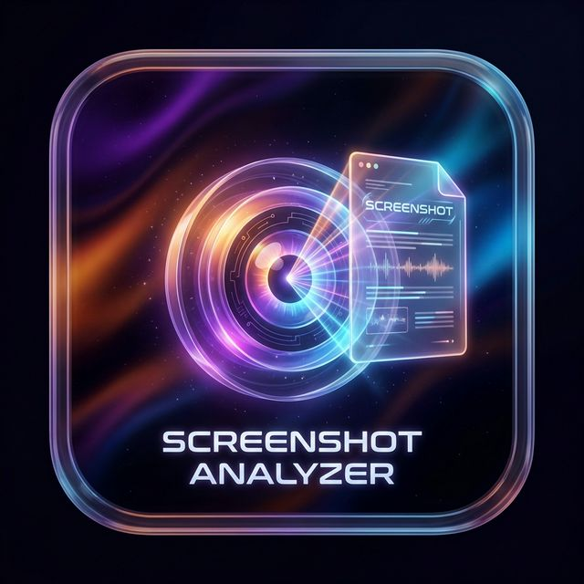
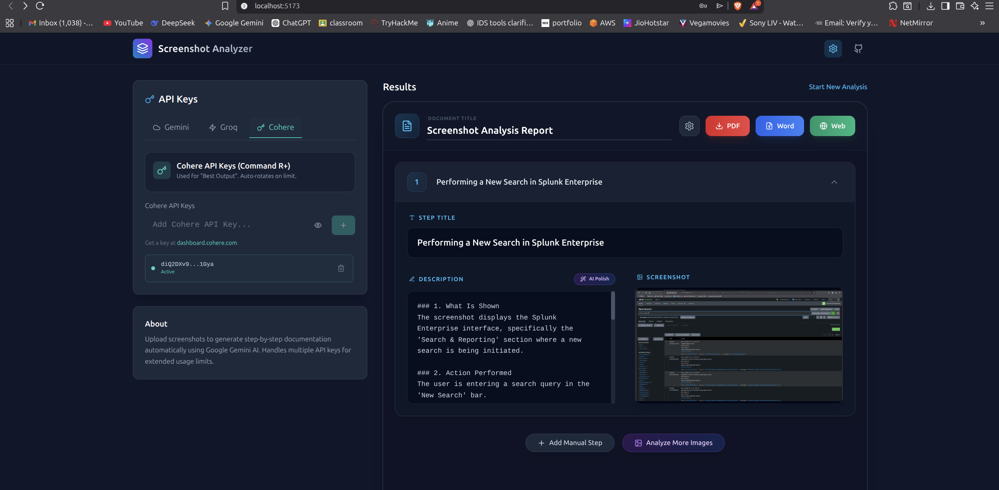

<div align="center">

  
  
  # 📸 Screenshot Analyzer AI
  
  **Turn Screenshots into Professional Documentation with AI**

  
  
  
  

  <p align="center">
    <b>Developed by Saichandram Sadhu 👨‍💻</b>
  </p>

  <a href="#installation"><strong>Download Now</strong></a> · <a href="#features"><strong>Explore Features</strong></a> · <a href="#how-it-works"><strong>See it in Action</strong></a>

  <br />

  <!-- 🚨 REPLACE THIS FILE WITH YOUR SCREENSHOT named 'screenshot.png' in 'assets' folder -->
  

</div>

<br />

---

## ⚡ Overview

**Screenshot Analyzer AI** is the ultimate tool for developers, technical writers, and creators. Simply **Drag & Drop** a screenshot, and watch as our AI automatically:
1.  👀 **Analyzes** the image.
2.  🧠 **Understands** the context.
3.  � **Writes** a step-by-step professional guide.

Powered by **Ollama (Local)**, **Google Gemini**, **Groq**, and **Cohere**.

---

## ✨ Why Use This?

| Feature | Description |
| :--- | :--- |
| 🚀 **Instant Analysis** | Get descriptions in seconds using cloud Llama 70B or Gemini. |
| 🔒 **Privacy First** | Use **Local LLMs** (Ollama/LLaVA) to run 100% offline. Zero data leak. |
| 🧠 **Multi-Model** | Switch between specific models for Speed vs Quality. |
| 📄 **Premium Exports** | Generate **PDFs** and **Word Docs** that look like they took hours to make. |
| 🎨 **Beautiful UI** | A modern, dark-themed interface built with React & Tailwind. |

---

## 🛠️ Tech Stack

<div align="center">
  
</div>

---

<h2 id="installation">⬇️ Installation</h2>

### 🪟 Windows
1.  Go to [Releases](https://github.com/saichandram-sadhu/AI-Image_Report_Creator-/releases).
2.  Download `.exe` file.
3.  Install & Run!

### 🐧 Linux (Ubuntu/Debian)
1.  Download `.AppImage` from Releases.
2.  Run:
    ```bash
    chmod +x Screenshot-Analyzer.AppImage
    ./Screenshot-Analyzer.AppImage
    ```

### 🍎 Mac
1.  Download `.dmg`.
2.  Drag to Applications.

---

## �👨‍💻 Developer

**Built with ❤️ and ☕ by Saichandram Sadhu**

---

<div align="center">
  <i>Give this repo a ⭐ if you found it useful!</i>
</div>

A powerful, cross-platform desktop application that turns screenshots into professional step-by-step documentation using AI.

---

## ✨ Features

-   **AI-Powered Analysis**: Automatically detects actions and UI elements in screenshots.
-   **Multi-Model Support**:
    -   **Ollama (Local)**: Runs 100% offline using Llama 3.2 Vision, LLaVA, etc.
    -   **Cloud APIs**: Supports Google Gemini, Groq (Llama 70B), and Cohere (Command R+).
-   **Smart Export**:
    -   **PDF**: Clean, professional reports with cover pages.
    -   **Word (DOCX)**: Fully editable documents.
    -   **HTML**: Web-ready guides.
-   **Privacy First**: Your data stays on your machine (when using Local AI).
-   **Cross-Platform**: Windows, Linux, and macOS.

---

## 🚀 Installation

### Windows 🪟
1.  Download the latest `.exe` from the Releases section.
2.  Double-click to install.
3.  The app will launch automatically.

### Linux (Ubuntu/Debian) 🐧
1.  Download the `.AppImage` file.
2.  Right-click -> Properties -> Permissions -> **Allow executing file as program**.
3.  Double-click to run.
*(Optional)* Run the provided `install.sh` to add the icon to your menu.

### Mac 🍎
1.  Download the `.dmg` file.
2.  Drag the app to your Applications folder.

---

## 🛠️ How to Use

1.  **Upload Screenshots**: Drag & drop images into the upload zone.
2.  **Select AI Model**: Choose "Local (Ollama)" for offline use or "Gemini/Groq" for cloud speed.
3.  **Analyze**: Click "Start Analysis". The AI will generate step-by-step descriptions.
4.  **Edit & Polish**: Use the editor to refine text. Click "Make Professional" to auto-polish via AI.
5.  **Export**: Click "Export PDF" or "Export Word" to save your guide.

---

## 👨‍💻 Developer

**Built with ❤️ by Saichandram Sadhu**

-   **Framework**: Electron + React + Vite
-   **Styling**: Tailwind CSS + Framer Motion
-   **AI Integration**: Ollama, Google GenAI SDK, Groq SDK

---

## ⚠️ Note for Developers

If you want to build this from source:

1.  Clone the repo.
2.  Run `npm install`.
3.  Run `npm run electron:dev` for development.
4.  Run `npm run electron:build` for production builds.

**Privacy Note:** This repository does NOT contain API keys. You must provide your own keys in the app settings.
